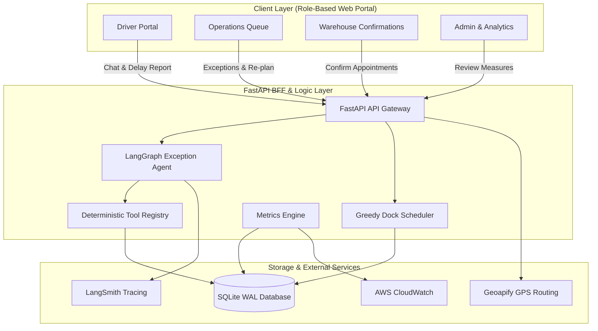
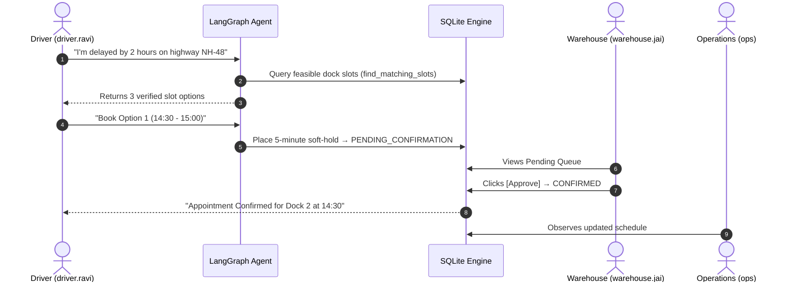

<p align="center">
  
</p>

<h1 align="center">SetuHaul</h1>

<p align="center">
  <strong>AI-Powered Dock Appointment Scheduling for Freight Logistics</strong><br/>
  <em>Autonomous exception resolution &bull; Real-time scheduling &bull; Full observability</em>
</p>

<p align="center">
  <strong>Demo Video:</strong> <a href="https://youtu.be/PbZfW4ShMTg">https://youtu.be/PbZfW4ShMTg</a>
</p>

<p align="center">
  <a href="http://100.27.41.46"></a>
  <a href="https://youtu.be/PbZfW4ShMTg"></a>
  <a href="https://us-east-1.console.aws.amazon.com/cloudwatch/home?region=us-east-1#dashboards:name=SetuHaul-Operations"></a>
  <a href="docs/ARCHITECTURE.md"></a>
  <a href="docs/SETUP.md"></a>
</p>

---

## Demo Video

<p align="center">
  <a href="https://youtu.be/PbZfW4ShMTg">
    
  </a>
</p>

<p align="center">
  <a href="https://youtu.be/PbZfW4ShMTg"><strong>Watch on YouTube &rarr;</strong></a>
</p>

---

## Live Hosted Links & Demo Credentials

| Service | Endpoint | Purpose |
|:--------|:---------|:--------|
| **Live Web Application** | **[http://100.27.41.46](http://100.27.41.46)** | Full interactive role portal (Driver, Ops, Warehouse, Admin) |
| **AWS CloudWatch Dashboard** | **[SetuHaul-Operations](https://us-east-1.console.aws.amazon.com/cloudwatch/home?region=us-east-1#dashboards:name=SetuHaul-Operations)** | Real-time AWS metric graphs for all 6 challenge measures |
| **Health Check API** | **[http://100.27.41.46/api/health](http://100.27.41.46/api/health)** | Live service heartbeat & LangSmith configuration status |
| **Demo Video** | **[YouTube](https://youtu.be/PbZfW4ShMTg)** | Full walkthrough of all features and monitoring |

### Demo Accounts

| Role | Username | Capabilities |
|:-----|:---------|:-------------|
| **Admin** | `admin` | Evaluation measures, master tables, baseline management, audit log |
| **Operations** | `ops` | Exception queue, facility dock scheduler, penalty approvals |
| **Warehouse** | `warehouse.jai` / `warehouse.ggn` | Review soft-holds, confirm/reject appointments |
| **Driver** | `driver.ravi` / `driver.amit` | Self-service delay reporting, GPS dual-ETA slot booking |
| **Carrier** | `carrier.bluedart` / `carrier.vtrans` | Inbound shipments, weekly reports, messaging |

---

## Table of Contents

| # | Section | Description |
|:-:|:--------|:------------|
| 1 | [System Architecture](#-system-architecture) | Mermaid diagram of the full stack |
| 2 | [Key Features](#-key-features--capabilities) | Agent, state machine, scheduler, observability |
| 3 | [Monitoring & Observability](#-monitoring--observability) | LangSmith tracing + CloudWatch metrics |
| 4 | [Performance Measures](#-performance-measures--live-results) | 6 challenge measures with formulas |
| 5 | [Golden Path](#-golden-path--workflow) | End-to-end workflow sequence diagram |
| 6 | [Technology Stack](#-technology-stack) | Full stack breakdown |
| 7 | [Automation Scripts](#-automation-scripts) | One-click scripts for dev and deploy |
| 8 | [Documentation](#-documentation) | Links to detailed engineering docs |

---

## System Architecture

SetuHaul replaces manual dispatcher phone calls with an **autonomous exception resolution agent** and a **greedy dock interval scheduler**.



---

## Key Features & Capabilities

| Feature | Description |
|:--------|:------------|
| **LangGraph Exception Agent** | Natural language understanding with **100% tool grounding** — zero hallucinated slots |
| **4-Phase Slot State Machine** | `SHOWN` → `SOFT_HOLD (5-min TTL)` → `PENDING_CONFIRMATION` → `CONFIRMED` — zero double-booking |
| **Dual-ETA Resolution** | Driver-declared + Geoapify GPS routing eliminates arrival optimism |
| **Greedy Dock Scheduler** | Priority tiers, in-progress protection, shift limits, facility operating windows |
| **6 Core Challenge Measures** | Trust, Autonomy, Fit, ETA Error, Wait Reduced, Time to Resolve — all tracked and surfaced |
| **Role-Based Dashboards** | 6 roles, 7 tabs, zero clutter — each stakeholder sees exactly what they need |

---

## Monitoring & Observability

SetuHaul ships with full production-grade observability across **LangSmith** (LLM tracing) and **AWS CloudWatch** (operational metrics).

### LangSmith Tracing

Every LangGraph agent turn is automatically traced to the `setuhaul-fde` project:

| Trace Table | Fields Captured |
|:------------|:----------------|
| `langsmith_run_summaries` | `latency_ms`, `error_flag`, `tool_call_count`, `token_estimate`, `trace_url` |
| `agent_turn_evals` | `invented_slot`, `skipped_tool`, `invalid_book_attempt`, `tool_grounding_score`, `langsmith_run_id` |
| `guardrail_events` | `guardrail_name`, `action` (BLOCK / ESCALATE / WARN), `detail` |

### AWS CloudWatch

9 custom metrics pushed to namespace `SetuHaul/Agent` (region: `ap-south-1`, period: 300s):

| Metric | Description |
|:-------|:------------|
| `Trust` | `1 - (agent_faults / cases)` — guardrail adherence |
| `Autonomy` | Self-resolved / total cases |
| `Fit` | First option accepted / cases with option data |
| `HumanHelpRate` | Cases requiring human intervention |
| `SelfServiceRate` | Resolved without ops takeover |
| `AvgResolveMin` | Mean resolution time in minutes |
| `AvgEtaErrorMin` | Mean absolute ETA prediction error |
| `AvgWaitReducedMin` | Mean wait time saved by rescheduling |
| `Cases` | Total case throughput |

**Dashboard widgets:** Agent Health & Autonomy · Resolution Speed & Quality · Case Throughput · Application Logs

**Push endpoint:** `POST /api/analytics/cloudwatch-metrics/push`

---

## Performance Measures & Live Results

| Measure | Category | Value | Baseline | Delta | Formula |
|:--------|:---------|:------|:---------|:------|:--------|
| **Time to Resolve** | SPEED | **< 1.0 min** | 45.0 min | **-45.0 min** (98% faster) | `avg(resolved_at - started_at)` |
| **Human Help Needed** | AUTONOMY | **50.0%** | 100.0% | **-50.0%** (halved) | `count(human_help=1) / total_cases` |
| **Self-Service Rescheduling** | AUTONOMY | **50.0%** | 0.0% | **+50.0%** | `count(resolved_without_ops) / total_resolved` |
| **ETA Error** | QUALITY | **GPS Verified** | 40.0 min | **Reduced** | `abs(actual_gate_in - predicted_eta)` |
| **First Option Accepted** | QUALITY | **100.0%** | 35.0% | **+65.0%** (high fit) | `count(option_1_accepted) / options_shown` |
| **Wait Reduced** | EFFICIENCY | **30.0 min** | 0.0 min | **+30.0 min saved** | `projected_wait_old - projected_wait_new` |

---

## Golden Path & Workflow



---

## Technology Stack

| Layer | Technology | Purpose |
|:------|:-----------|:--------|
| **Frontend** | React + TypeScript + Vite | Role-based SPA, dark/light theme, KPI dashboards |
| **Backend** | FastAPI (Python 3.12) | Async REST BFF, Pydantic validation, JWT auth |
| **AI Agent** | LangGraph + OpenRouter | State graph, deterministic tool grounding, guardrails |
| **Database** | SQLite (WAL Mode) | ACID transactions, zero external dependencies |
| **GPS** | Geoapify API | Dual-ETA route calculations, traffic buffering |
| **Observability** | AWS CloudWatch + LangSmith | Custom dashboards, metric alarms, LLM tracing |
| **Cloud** | AWS EC2 (t2.micro Free Tier) | 100% Free Tier with GP3 EBS persistent storage |
| **Tests** | pytest (15 passing) | Agent, booking, scheduling, concurrency, metrics |

---

## Automation Scripts

All scripts are in the [`scripts/`](scripts) folder:

```bash
# Start full local application (FastAPI on :8000 + Vite UI on :5173)
./scripts/start.sh

# Stop all running SetuHaul processes
./scripts/stop.sh

# Run complete pytest test suite
make test

# Execute automated scenario verification suite (6 golden paths)
./scripts/run_scenarios.sh

# Execute dual-driver same-slot concurrency race check
./scripts/concurrency_demo.sh

# Run evening crunch simulation (10 delayed drivers vs 4 evening slots)
python3 scripts/evening_crunch.py

# Push live KPIs to AWS CloudWatch Dashboard
python3 scripts/push_cloudwatch_metrics.py

# Deploy stack directly to AWS Free Tier
./scripts/deploy_aws.sh

# Rebuild SQLite database from schema, seed, and migrations
./scripts/reset_db.sh
```

---

## Documentation

| Doc | Description |
|:----|:------------|
| [ARCHITECTURE.md](docs/ARCHITECTURE.md) | System architecture, state machine, scheduling design |
| [SETUP.md](docs/SETUP.md) | Local installation, environment variables, Docker setup |
| [ROADMAP.md](docs/ROADMAP.md) | Development phases and enterprise scaling roadmap |
| [SCENARIOS.md](docs/SCENARIOS.md) | Step-by-step verification flows for all 6 test scenarios |
| [database_guide.md](docs/database_guide.md) | SQLite schema, table indexes, ER diagram |
| [specs.md](docs/specs.md) | Core functional specifications and domain rules |
| [findings.md](docs/findings.md) | Requirements gap review and remaining items |

---

<p align="center">
  <sub>Built with FastAPI &bull; React &bull; LangGraph &bull; CloudWatch &bull; LangSmith</sub>
</p>
