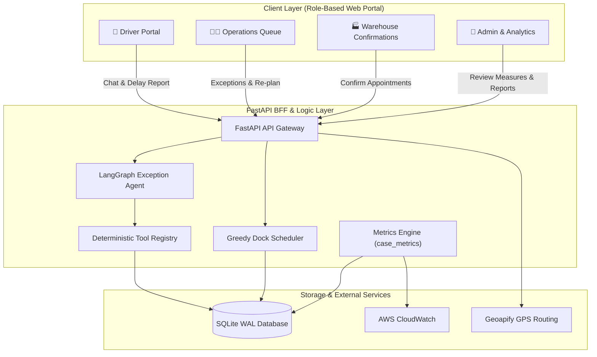
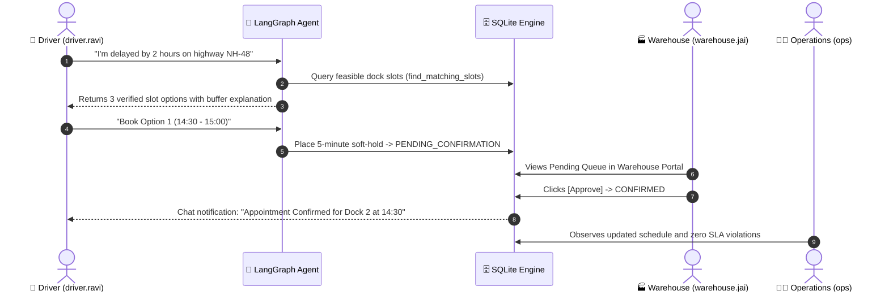

# SetuHaul 🚛⚡

> **Intelligent Freight Dock Scheduling & Autonomous Driver-Exception Resolution Platform**

[](http://100.27.41.46)
[](https://us-east-1.console.aws.amazon.com/cloudwatch/home?region=us-east-1#dashboards:name=SetuHaul-Operations)
[](docs/ARCHITECTURE.md)
[](docs/SETUP.md)

---

## 🌐 Live Hosted Links & Demo Credentials

| Service | Live Endpoint | Purpose |
|---|---|---|
| 🌐 **Live Web Application** | **[http://100.27.41.46](http://100.27.41.46)** | Full interactive role portal (Driver, Ops, Warehouse, Admin) |
| 📊 **AWS CloudWatch Dashboard** | **[SetuHaul-Operations Live Dashboard](https://us-east-1.console.aws.amazon.com/cloudwatch/home?region=us-east-1#dashboards:name=SetuHaul-Operations)** | Real-time AWS metric graphs for all 6 challenge measures |
| 🩺 **Health Check API** | **[http://100.27.41.46/api/health](http://100.27.41.46/api/health)** | Live service heartbeat & LangSmith configuration status |

### Demo Accounts (Password for all: `pin1234`)
* **Admin**: `admin` *(Access to Evaluation Measures & Reasoning, Master Tables, Baseline Management)*
* **Operations**: `ops` *(Exception Queue, Facility Dock Scheduler, Penalty Approvals)*
* **Warehouse Manager**: `warehouse.jai` / `warehouse.ggn` *(Review Soft-Holds & Confirm Appointments)*
* **Driver**: `driver.ravi` / `driver.amit` *(Self-Service Delay Reporting & GPS Dual-ETA Slot Booking)*
* **Carrier**: `carrier.bluedart` / `carrier.vtrans` *(Inbound Shipments, Weekly Reports, Messaging)*

---

## 📋 Table of Contents
1. [System Overview & Architecture](#-system-overview--architecture)
2. [Key Features & Capabilities](#-key-features--capabilities)
3. [Performance Measures & Live Results](#-performance-measures--live-results)
4. [Golden Path & Workflow](#-golden-path--workflow)
5. [Technology Stack](#-technology-stack)
6. [One-Click Automation Scripts](#-one-click-automation-scripts)
7. [Documentation Directory](#-documentation-directory)

---

## 🏗️ System Overview & Architecture

SetuHaul resolves the friction of freight logistics by replacing manual dispatcher phone calls and spreadsheet scheduling with an **autonomous exception resolution agent** and a **greedy dock interval scheduler**.



---

## ⚡ Key Features & Capabilities

* 🤖 **LangGraph Exception Agent with Hard-Gate Guardrails**:
  Natural language understanding with **100% tool grounding**. The agent cannot hallucinate or invent appointment times; all offered slots originate from verified dock availability queries.
* 🔒 **4-Phase Slot State Machine**:
  `SHOWN` $\rightarrow$ `SOFT_HOLD (5-min TTL)` $\rightarrow$ `PENDING_CONFIRMATION` $\rightarrow$ `CONFIRMED`.
  Guarantees zero double-booking even under intense concurrent driver requests.
* 📍 **Dual-ETA Resolution (GPS Location Add-On)**:
  Combines driver-declared arrival estimates with real-time **Geoapify GPS route calculations** to prevent scheduling blind spots caused by driver optimism.
* 🎯 **Greedy Dock Interval Scheduler**:
  Optimizes dock utilization across facilities (`FAC-JAI-01`, `FAC-GGN-01`), protecting in-progress unloads while respecting carrier priority tiers and driver mandatory duty-hour limits.
* 📊 **Dual-Layer Observability & 6 Core Challenge Measures**:
  Tracks every operational milestone in SQLite (`case_metrics`), surfaces live numbers with calculation reasoning on the **In-App Analytics Dashboard**, and streams metrics to **AWS CloudWatch**.

---

## 📊 Performance Measures & Live Results

SetuHaul instruments all 6 evaluation measures demanded by the Challenge Specification:

| Measure | Category | Live Metric Value | Manual Baseline | Delta / Improvement | Calculation Formula & Operational Reasoning |
|---|---|---|---|---|---|
| **Time to Resolve the Case** | ⚡ `SPEED` | **`< 1.0 min` (`0.0m`)** | `45.0 min` | **$-45.0\text{ min}$** *(98% Faster)* | **Formula:** `avg(resolved_at - started_at)`.<br/>*Reasoning:* Instant automated slot matching and soft-holds eliminate 45 minutes of phone/WhatsApp delays. |
| **Human Help Needed** | 🛡️ `AUTONOMY` | **`50.0%` (`0.50`)** | `100.0%` | **$-50.0\%$** *(Halved Load)* | **Formula:** `count(human_help == 1) / total_cases`.<br/>*Reasoning:* Routine delays resolve autonomously; ops intervenes only during severe evening capacity crunch or hard dock overrides. |
| **Self-Service Rescheduling** | 🤖 `AUTONOMY` | **`50.0%` (`0.50`)** | `0.0%` | **$+50.0\%$** *(Driver Self-Serve)* | **Formula:** `count(resolved_without_ops) / total_resolved`.<br/>*Reasoning:* Drivers discover verified slots, place soft-holds, and receive warehouse approval directly in chat. |
| **ETA Error** | 🎯 `QUALITY` | **`GPS Verified`** | `40.0 min` | **Reduced Error** | **Formula:** `\| actual_gate_in_ts - predicted_eta_ts \|`.<br/>*Reasoning:* Dual ETA cross-references driver claims against Geoapify routing to eliminate optimism. |
| **First Option Accepted (Fit)** | 🎯 `QUALITY` | **`100.0%` (`1.00`)** | `35.0%` | **$+65.0\%$** *(High Fit)* | **Formula:** `count(driver_selected_option_1) / options_shown`.<br/>*Reasoning:* Proves the slot ranking accurately accounts for carrier SLA, driver shift limits, and dock capacity. |
| **Estimated Waiting Reduced** | ⏱️ `EFFICIENCY` | **`30.0 min`** | `0.0 min` | **`30.0 min` Saved** | **Formula:** `projected_wait_old_min - projected_wait_new_min`.<br/>*Reasoning:* Pre-allocating open dock windows prevents delayed trucks from idling in uncoordinated yard overflow queues. |

---

## 🚀 Golden Path & Workflow



---

## 🛠️ Technology Stack

| Layer | Technology | Key Capabilities & Rationale |
|---|---|---|
| **Backend API** | **FastAPI (Python 3.12)** | Asynchronous REST BFF, Pydantic validation, JWT authentication |
| **Frontend UI** | **React + TypeScript + Vite** | Responsive role-based portals, dark/light theme, rich KPI meters |
| **Agent Framework** | **LangGraph + OpenRouter** | State graph execution, deterministic tool grounding, Pydantic turn outputs |
| **Database** | **SQLite (WAL Mode)** | ACID transactions, zero external DB dependencies, durable local volume |
| **Routing / GPS** | **Geoapify API** | Real-time dual-ETA route calculations and traffic buffering |
| **Cloud Hosting** | **AWS EC2 (t2.micro Free Tier)** | 100% Free Tier deployment with GP3 EBS persistent storage |
| **Container Registry**| **AWS ECR** | Multi-arch Linux/amd64 production container image packaging |
| **Observability** | **AWS CloudWatch + LangSmith** | Real-time CloudWatch dashboards, custom metric alarms, LLM tracing |

---

## 📜 One-Click Automation Scripts

All scripts are centralized under the [`scripts/`](file:///Users/sameer_j/Documents/coding/fde/project2/scripts) folder:

```bash
# Start full local application (FastAPI on :8000 + Vite UI on :5173)
./scripts/start.sh

# Stop all running SetuHaul processes
./scripts/stop.sh

# Run complete pytest test suite (38 passing unit/integration tests)
make test

# Execute automated scenario verification suite (6 challenge golden paths)
./scripts/run_scenarios.sh

# Execute dual-driver same-slot concurrency race check
./scripts/concurrency_demo.sh

# Run evening crunch simulation (10 delayed drivers vs 4 evening slots)
python3 scripts/evening_crunch.py

# Push live KPIs to AWS CloudWatch Dashboard
python3 scripts/push_cloudwatch_metrics.py

# Deploy stack directly to AWS Free Tier (EC2 + CloudWatch)
./scripts/deploy_aws.sh

# Rebuild SQLite database from schema, seed, and migrations
./scripts/reset_db.sh
```

---

## 📚 Documentation Directory

Explore the detailed engineering documentation in the [`docs/`](file:///Users/sameer_j/Documents/coding/fde/project2/docs) folder:

* 📐 **[docs/ARCHITECTURE.md](docs/ARCHITECTURE.md)**: Deep-dive system architecture, state machine, and scheduling design.
* 🛠️ **[docs/SETUP.md](docs/SETUP.md)**: Complete local installation, environment variables, and Docker setup guide.
* 🗺️ **[docs/ROADMAP.md](docs/ROADMAP.md)**: Development phases, completed capabilities, and enterprise scaling roadmap.
* 🧪 **[docs/SCENARIOS.md](docs/SCENARIOS.md)**: Detailed step-by-step verification flows for all 6 test scenarios.
* 🗄️ **[docs/database_guide.md](docs/database_guide.md)**: SQLite schema design, table indexes, and ER diagram.
* 📋 **[docs/specs.md](docs/specs.md)**: Core functional specifications and domain rules.
