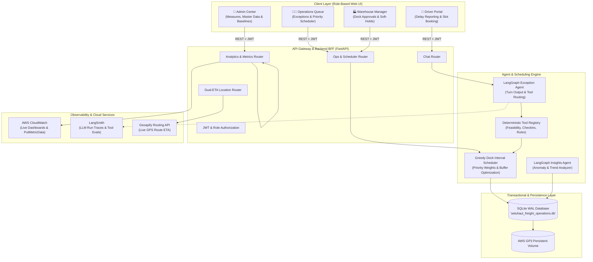
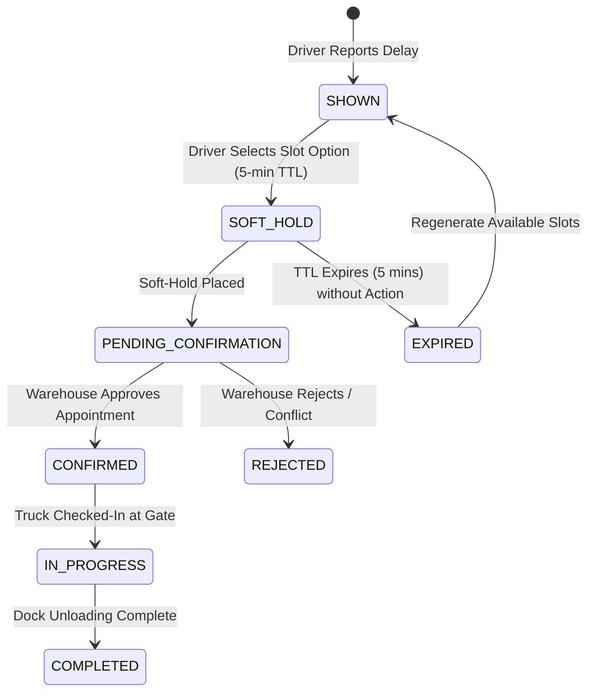
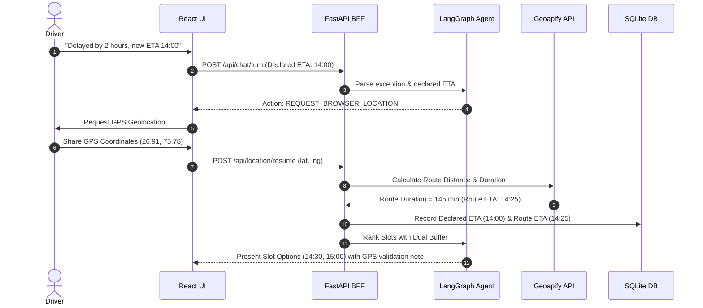
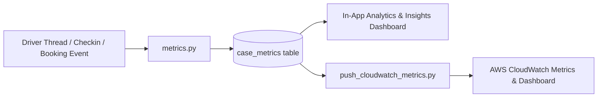
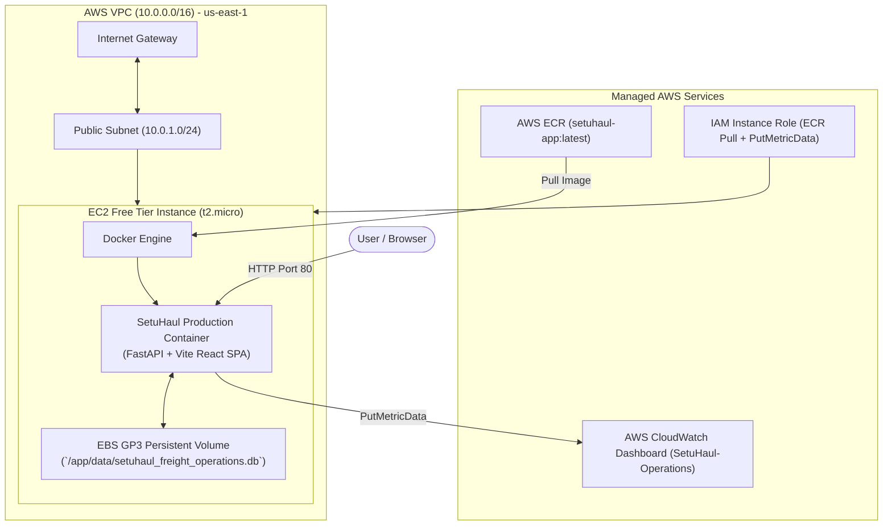

# SetuHaul Architecture & Technical Design

## 1. Executive Summary

**SetuHaul** is an enterprise-grade freight dock-scheduling and driver-exception resolution system. It automates delay reporting, dock re-allocation, appointment confirmations, and operational visibility across manufacturing and logistics hubs.

The system combines **FastAPI**, **React + TypeScript**, a **deterministic constraint-based scheduling engine**, a **LangGraph-powered conversational agent** with strict tool-calling guardrails, and a **SQLite (WAL) transactional database** with dual-layer observability (**In-App Analytics** and **AWS CloudWatch**).

---

## 2. High-Level System Architecture

---

## 3. Core Subsystems & Component Interaction

### 3.1 Backend Service (`backend/app/`)
* **FastAPI Application Framework**: Exposes REST endpoints grouped by business role (`/api/auth`, `/api/chat`, `/api/ops`, `/api/admin`, `/api/analytics`, `/api/location`, `/api/penalty`, `/api/messages`).
* **JWT Authentication & RBAC**: Enforces strict role-based access control for `DRIVER`, `OPERATIONS`, `WAREHOUSE`, `ADMIN`, `CARRIER`, and `CUSTOMER`.
* **Database Management (`app/db.py`)**: Manages SQLite connections with Write-Ahead Logging (`WAL`), automated schema creation, seed expansion, and atomic transaction locks.

### 3.2 LangGraph Exception Agent (`app/agent/`)
* **Deterministic Tool Grounding**: The LLM acts strictly as a communication and reasoning coordinator; all slot discoveries, soft-holds, driver verifications, and rule lookups are executed through deterministic Python tools in `app/agent/tools.py`.
* **Zero Hallucination Guarantee**: Every slot returned to the driver must have a verified `slot_id` issued by `find_matching_slots`. Hard gate evaluators reject any turn attempting to offer ungrounded timestamps.
* **Structured Output (`AgentTurnOutput`)**: Ensures predictable, schema-validated JSON turns containing message text, options list, actions required (e.g. `REQUEST_BROWSER_LOCATION`), and state flags.

---

## 4. Slot State Machine & Concurrency Control

### Concurrency & Double-Booking Protection:
* When multiple drivers request overlapping slots simultaneously, SQLite atomic transactions place a **soft-hold with a 5-minute TTL** on the first committed write.
* Competing drivers attempting to select the same slot are immediately notified of the conflict and provided with the next best available time window.

---

## 5. Greedy Dock Interval Scheduler

The scheduling engine (`backend/app/services/booking.py`) provides automated time-interval sequencing across all active dock doors in a facility:

### Objective Function:
$$\text{Score} = \text{Priority Weight} + \text{On-Site Bonus} - (\text{Lateness Penalty} \times \Delta t_{\text{delay}}) - (\text{Idle Gap Penalty} \times \Delta t_{\text{idle}})$$

### Core Scheduling Policies:
1. **Facility Scoping**: Schedules are strictly isolated per facility (`FAC-JAI-01`, `FAC-GGN-01`). Cross-facility appointments are rejected by design.
2. **In-Progress Protection**: Trucks currently docked or unloading cannot be bumped or preempted.
3. **Carrier Priority Tiering**: Critical/perishable shipments receive highest dock priority; normal freight fills remaining optimal intervals.
4. **Driver Duty Limits**: Hard-gate validation ensures no driver is scheduled past their mandatory maximum on-duty shift hours.

---

## 6. Dual ETA Architecture (Location Add-On)

To eliminate the discrepancy between subjective driver optimism and real-world traffic delays, SetuHaul maintains a **Dual ETA model**:

---

## 7. Observability & 6 Core Challenge Measures

SetuHaul instruments all operational events into the `case_metrics` table:

### The 6 Evaluation Measures:
1. **Time to Resolve the Case (`avg_resolve_min`)**: Time from initial delay report to confirmed/usable plan ($< 1.0\text{ min}$ automated vs $45.0\text{ min}$ manual).
2. **Human Help Needed (`human_help_rate`)**: Percentage of cases requiring operations manager takeover ($50.0\%$ vs $100.0\%$).
3. **Self-Service Rescheduling (`self_service_rate`)**: Share of driver requests completed end-to-end autonomously ($50.0\%$ vs $0.0\%$).
4. **ETA Error (`avg_eta_error_min`)**: Difference between predicted ETA and actual gate-in check-in timestamp.
5. **First Option Accepted (`fit`)**: Frequency with which drivers select Option #1 ($100.0\%$ vs $35.0\%$).
6. **Estimated Waiting Reduced (`avg_wait_reduced_min`)**: Yard dwell time saved by pre-allocating open dock windows.

---

## 8. AWS Cloud Deployment Architecture

The production environment is hosted on AWS using a CloudFormation template ([`deploy/aws-ec2-stack.yaml`](../deploy/aws-ec2-stack.yaml)):

