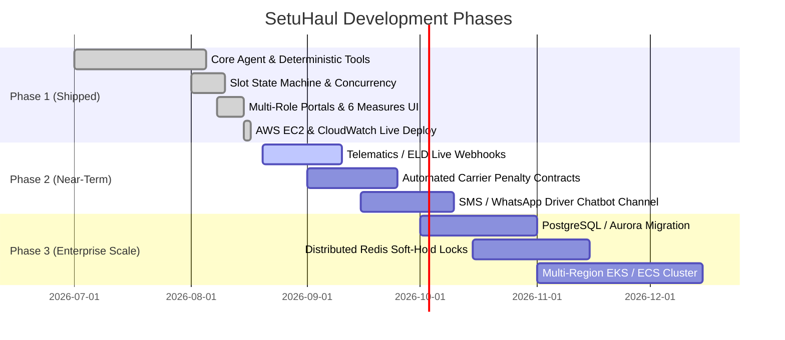

# SetuHaul Development & Scaling Roadmap

This document outlines the shipped capabilities, immediate enhancements, and long-term enterprise scalability milestones for the **SetuHaul** platform.

---

## 🗺️ Milestone Matrix

---

## 1. Phase 1: Core System & Classroom Challenge (Shipped ✅)

- [x] **FastAPI BFF + React SPA**: High-performance backend paired with dark/light themed, responsive role-based frontend.
- [x] **Deterministic Dock Scheduling Engine**: Greedy time-interval allocation respecting priority tiers, shift limits, and facility operating windows.
- [x] **LangGraph Exception Agent**: Natural language delay parsing with strict deterministic tool-calling guardrails (zero ungrounded/hallucinated slots).
- [x] **4-Phase Slot Lifecycle**: `SHOWN` $\rightarrow$ `SOFT_HOLD (5-min TTL)` $\rightarrow$ `PENDING_CONFIRMATION` $\rightarrow$ `CONFIRMED`.
- [x] **Dual ETA Resolution**: Driver-declared arrival times combined with Geoapify GPS routing calculations.
- [x] **Multi-Facility Scoping**: Strict isolation across regional facilities (`FAC-JAI-01`, `FAC-GGN-01`).
- [x] **6 Core Evaluation Measures & Reasoning**: Full mathematical tracking and visual UI cards for Resolution Time, Human Help %, Self-Service %, ETA Error, Fit %, and Wait Time Savings.
- [x] **AWS Cloud Deployment**: Production AWS EC2 Free Tier stack (`t2.micro` + EBS persistent volume) with live CloudWatch dashboard.

---

## 2. Phase 2: Operational Enhancements (Near-Term 🔄)

- [ ] **ELD / Telematics Webhook Ingestion**: Ingest live GPS coordinates and engine diagnostics from Samsara, Geotab, or Trimble devices automatically.
- [ ] **Automated Penalty & SLA Enforcement**: Automated detention fee calculation and dispute resolution workflows for chronic carrier delays.
- [ ] **Omnichannel Driver Interface**: Expand beyond web chat to native **WhatsApp Business API** and two-way SMS interfaces for drivers on the road.
- [ ] **Voice-to-Text Driver Exception Reporting**: Enable hands-free voice notes for drivers reporting highway breakdowns or traffic congestion.

---

## 3. Phase 3: Enterprise Scale & Multi-Region (Future 🚀)

- [ ] **Distributed Database Layer**: Migrate SQLite single-writer to **Amazon Aurora PostgreSQL Serverless v2** for multi-region active-active replication.
- [ ] **Redis Distributed Locking (Redlock)**: Replace in-database soft-holds with high-throughput Redis TTL keys for sub-millisecond slot reservations.
- [ ] **Multi-Facility Cross-Docking**: Intelligent re-routing between nearby facilities when one hub hits 100% capacity during emergency storms or peak seasons.
- [ ] **Machine Learning Dwell-Time Forecasting**: Predictive models to adjust standard dock turnaround times based on cargo SKU weight, carrier historical unloading speed, and weather.
