# SetuHaul Stress Scenarios & Data Imperfections Guide

This document details the architectural handling, test suites, and operational verification for all **Section 11.2 Required Stress Scenarios** and **Section 11.3 Data Imperfections** required by the SetuHaul Challenge Specification.

---

## 📋 Section 11.2: Required Stress Scenarios

```mermaid
flowchart TD
    subgraph S11_2 ["11.2 Stress Scenarios"]
        S1["1. Evening Crunch (10 Drivers vs 4 Slots)"]
        S2["2. Mixed Dock Pulse (Early/Late/Unloading/In-Transit)"]
        S3["3. Sub-Second Soft-Hold Race"]
        S4["4. Mid-Conversation Capacity Reduction"]
        S5["5. Mid-Conversation Slot Cancellation"]
        S6["6. Weak Connectivity Message Duplication"]
        S7["7. Multi-Shipment Driver Disambiguation"]
        S8["8. Non-Linear Repair Delay vs ETA Shift"]
        S9["9. Late-Entering High Priority Shipment"]
        S10["10. No Feasible Same-Day Slot Escalation"]
        S11["11. Warehouse Conflicting Schedule Decision"]
    end

    S1 --> Test1["scripts/evening_crunch.py<br/>test_evening_crunch.py"]
    S2 --> Test2["test_scheduling.py<br/>test_duty_time_gating.py"]
    S3 --> Test3["scripts/concurrency_demo.sh<br/>SQLite Atomic Locks"]
    S4 --> Test4["options_are_stale & OpMsg"]
    S5 --> Test5["cancel_appointment & Auto-Free"]
    S6 --> Test6["chat.py Message Deduplication"]
    S7 --> Test7["graph.py Active Shipments Filter"]
    S8 --> Test8["eta.py Dual ETA Route Calculation"]
    S9 --> Test9["booking.py Priority Weight Engine"]
    S10 --> Test10["graph.py NO_FEASIBLE_SLOTS Node"]
    S11 --> Test11["decide_appointment Collision Check"]
```



---

### 1. Evening Crunch (10 Drivers vs 3–4 Compatible Slots)
* **Scenario**: 10 delayed trucks request reschedule slots for the same evening window (18:00–21:00) at `FAC-JAI-01` when only 3–4 dock intervals are available.
* **System Handling**:
  * The greedy priority scheduler ranks requests by priority tier (`CRITICAL` > `HIGH` > `NORMAL`), carrier SLA, and arrival buffer.
  * The top 3–4 candidates receive soft-holds with guaranteed dock interval assignments.
  * The remaining 6–7 drivers are placed on a managed waitlist or escalated to Ops with zero double-booking.
* **Automated Verification**:
  ```bash
  PYTHONPATH=backend backend/.venv/bin/python scripts/evening_crunch.py
  # OR:
  PYTHONPATH=backend backend/.venv/bin/pytest backend/tests/test_evening_crunch.py
  ```

---

### 2. Complex Yard State (Early, Late, Unloading, In-Transit)
* **Scenario**: Concurrently:
  * Truck A is early and waiting in yard.
  * Truck B arrived late and is waiting.
  * Truck C is currently docked and unloading.
  * Truck D has declared a revised ETA but has not arrived.
* **System Handling**:
  * **In-Progress Protection**: Truck C's dock interval is locked (`IN_PROGRESS`); it cannot be preempted or bumped.
  * **Early Arrivals**: Truck A is assigned an available early staging window or held in yard buffer without jumping the queue over on-time trucks.
  * **Late Arrivals**: Truck B is re-sequenced into the next feasible open gap.
* **Automated Verification**:
  ```bash
  PYTHONPATH=backend backend/.venv/bin/pytest backend/tests/test_scheduling.py
  ```

---

### 3. Sub-Second Soft-Hold Race Condition
* **Scenario**: Driver 1 and Driver 2 attempt to select the same slot (`SLOT-JAI-019`) within milliseconds of each other.
* **System Handling**:
  * SQLite atomic transactions place a `SOFT_HOLD` (5-minute TTL) for the first committed transaction.
  * The second transaction fails the soft-hold condition, immediately triggers slot contention recovery, and offers the next best available slot.
* **Automated Verification**:
  ```bash
  ./scripts/concurrency_demo.sh
  ```

---

### 4. Mid-Conversation Capacity Reduction
* **Scenario**: A dock door goes out of service or facility operating hours are reduced while a driver is reviewing slot options.
* **System Handling**:
  * When capacity drops, `options_are_stale(thread_id)` detects that the previously offered `slot_id` is no longer valid.
  * The system flags `options_stale: true`, sends an automated operational notice (*"Revised plan — options changed"*), and regenerates fresh valid options.

---

### 5. Mid-Conversation Slot Cancellation
* **Scenario**: Another truck cancels its appointment, suddenly freeing an optimal slot while a delayed driver is chatting with the bot.
* **System Handling**:
  * `cancel_appointment` immediately reverts the slot status to `AVAILABLE` (`is_current = 0`).
  * On the driver's next turn or poll, the new slot is ranked and surfaced at the top of the recommendation list.

---

### 6. Weak Connectivity & Duplicate Messages
* **Scenario**: A driver on a highway with patchy network resends the same delay message multiple times within seconds.
* **System Handling**:
  * `app/services/chat.py` computes a temporal message hash. If an identical message is received from the same driver within 60 seconds, it is marked with `is_duplicate = 1` and deduplicated, preventing duplicate exception records or double soft-holds.

---

### 7. Multi-Shipment Driver Disambiguation
* **Scenario**: Driver Ravi (`DRV006`) has multiple active assigned shipments (`SHP1006`, `SHP1021`, `SHP1206`).
* **System Handling**:
  * If the driver doesn't specify a shipment ID, the agent checks active shipments. If multiple exist, it lists the options and prompts: *"You have multiple active shipments. Which one is this about? (SHP1006, SHP1021, SHP1206)"*.
* **Automated Verification**:
  ```bash
  PYTHONPATH=backend backend/.venv/bin/pytest backend/tests/test_chat.py
  ```

---

### 8. Non-Linear Delay: 90-min Repair $\neq$ 90-min ETA Shift
* **Scenario**: A driver reports a 90-minute tyre repair at 10:00 AM on highway NH-48.
* **System Handling**:
  * The system does not simply add 90 minutes to the old ETA.
  * It evaluates: $\text{Current Clock} + \text{Repair Duration (90m)} + \text{Remaining Route Transit Time (Geoapify GPS)} + \text{Safety Buffer}$.
  * The resulting ETA accurately accounts for traffic and distance rather than a simplistic linear addition.

---

### 9. High-Priority Shipment Late Arrival
* **Scenario**: A high-priority medical load (`PRIORITY: HIGH` / `CRITICAL`) enters the exception queue after several normal-priority shipments have already queued.
* **System Handling**:
  * The greedy scheduling algorithm incorporates priority weighting ($W_{\text{priority}} = 100$ for High/Critical vs $10$ for Normal).
  * The medical load receives priority dock assignment over general cargo, minimizing detention penalties.
* **Automated Verification**:
  ```bash
  PYTHONPATH=backend backend/.venv/bin/pytest backend/tests/test_penalty_workflow.py
  ```

---

### 10. No Feasible Same-Day Slot Escalation
* **Scenario**: A refrigerated (reefer) truck arrives late when no reefer-compatible dock doors have remaining capacity today.
* **System Handling**:
  * The agent detects zero compatible slots (`find_matching_slots` returns empty).
  * It sets `escalate: true` with reason `NO_FEASIBLE_REEFER_SLOT` and pushes the case directly to the **Operations Queue** for manual dock reassignment or overnight holding.

---

### 11. Warehouse Schedule Decision Conflict
* **Scenario**: A warehouse manager attempts to approve an appointment that conflicts with an existing confirmed truck on Dock 2.
* **System Handling**:
  * `decide_appointment` validates slot lock integrity at the moment of approval.
  * If a collision exists, approval is rejected with an explicit error message, preventing dock double-booking.

---

## 🔍 Section 11.3: Data Imperfections Handling

| Data Imperfection | Operational Risk | SetuHaul Defense & Architecture Handling |
|---|---|---|
| **Missing Delay Duration / Uncertain Repair** | Cannot compute arrival window | Agent enters structured clarification mode (`need_clarification = True`, capped at `max_clarification_turns = 4`) to solicit estimated repair completion or current mile marker before generating slots. |
| **Free-Text Location & Inconsistent Spelling** | GPS routing failure | Geoapify fuzzy geocoding normalizes misspellings (e.g. *"Kotputli"*, *"Kotputly"*, *"Near Shahpura toll"*) into accurate lat/long coordinates. |
| **Stale / Corrected ETA Timestamps** | Conflicting driver estimates | `eta_history` table stores all timestamp revisions with `capture_time` and `source`. The latest verified timestamp (`effective_eta_ts` in `v_latest_eta`) supersedes historical noise. |
| **Cancelled Appointments in History** | Ghost slot blocking | Cancelled appointments maintain `appointment_status = 'CANCELLED'` with `is_current = 0`. They remain queryable for audit trails but are ignored by dock availability checks. |
| **Partial-Day Facility Rules** | Scheduling trucks during restricted hours | Evaluated via `facility_rules` table (`backend/tests/test_partial_day_rules.py`). e.g., No heavy vehicle entry between 08:00–11:00 or quiet hours. Slots overlapping restricted periods are automatically pruned. |
| **Diverse Descriptions for Same Exception** | Categorization inconsistency | LLM intent normalization categorizes varied text (*"tyre burst"*, *"puncture"*, *"engine overheated"*, *"heavy jam"*) into standardized `ExceptionType` (`BREAKDOWN`, `TRAFFIC`, `WEATHER`). |

---

## 🧪 Comprehensive Test Suite Execution

Run the complete test suite covering all stress scenarios and data imperfections:

```bash
# Run all 38 unit & integration tests
make test

# Run end-to-end scenario runner
./scripts/run_scenarios.sh

# Run concurrency race check
./scripts/concurrency_demo.sh

# Run evening crunch simulation
PYTHONPATH=backend backend/.venv/bin/python scripts/evening_crunch.py
```
