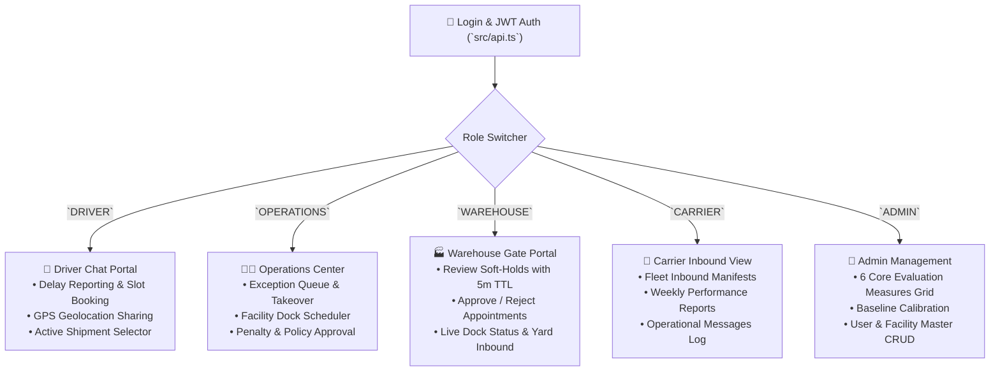

# SetuHaul Frontend Portal 🎨⚡

> **High-Performance Role-Based Web Application for Freight Exception Handling & Dock Scheduling**

The SetuHaul frontend is built with **React 19**, **TypeScript**, and **Vite**, offering dedicated operational portals for Drivers, Operations Managers, Warehouse Supervisors, Carriers, and System Administrators.

---

## 🏗️ Architecture & Component Layout

```
frontend/
├── public/                 # Static brand assets and SVGs
│   ├── logo.svg            # SetuHaul brand logo
│   └── favicon.svg         # Tab favicon
├── src/
│   ├── main.tsx            # React application entry point & root mount
│   ├── App.tsx             # Main orchestrator containing all role panels & state guards
│   ├── App.css             # Vanilla CSS design system (dark/light theme tokens, glassmorphism)
│   ├── api.ts              # Type-safe REST client for FastAPI BFF with JWT auth headers
│   └── icons.tsx           # Custom SVG icon catalog
├── package.json            # Node.js dependencies & scripts
├── tsconfig.json           # TypeScript configuration
└── vite.config.ts          # Vite build & proxy configuration
```

---

## 👥 Role Portals & Interactive Panels

The UI automatically tailors views based on the authenticated user's role:



---

## 📊 Analytics & Evaluation Measures Center

Located in the **Analytics** view (`AnalyticsPanel` in [`src/App.tsx`](file:///Users/sameer_j/Documents/coding/fde/project2/frontend/src/App.tsx)), this section renders the **Performance Measures & Calculation Reasoning** grid:

* ⚡ **Time to Resolve the Case**: Live duration vs manual benchmark with mathematical breakdown.
* 🛡️ **Human Help Needed**: Percentage of cases requiring operations manager takeover.
* 🤖 **Self-Service Rescheduling**: Percentage of delay requests resolved end-to-end autonomously.
* 🎯 **ETA Error**: Real-time dual-ETA gate-in synchronization delta.
* 🎯 **First Option Accepted (Fit)**: Measures slot recommendation accuracy.
* ⏱️ **Estimated Waiting Reduced**: Yard dwell time saved per rescheduled arrival.

Each card displays:
1. **Hero Metric Number** with categorization badge (`SPEED`, `AUTONOMY`, `QUALITY`, `EFFICIENCY`).
2. **Comparison against Manual Baselines** with delta tags.
3. **Calculation Formula Box**.
4. **Operational Business Rationale**.

---

## 🛠️ Development & Build Commands

```bash
# 1. Install frontend dependencies
npm install

# 2. Run local development server with Hot Module Replacement (HMR)
npm run dev
# Running on http://127.0.0.1:5173 (proxied to backend on :8000)

# 3. Type-check & build production bundle
npm run build
# Outputs compiled bundle to frontend/dist/ (served by FastAPI in production)

# 4. Preview compiled production bundle locally
npm run preview
```

---

## 🔐 Authentication & API Integration

* **JWT Storage**: Tokens are stored in `localStorage` under `setuhaul_token` and automatically attached to API requests via the `authHeaders()` interceptor in [`src/api.ts`](file:///Users/sameer_j/Documents/coding/fde/project2/frontend/src/api.ts).
* **Role Guards**: Component trees check `user.role` to restrict unauthorized actions (e.g., driver chat vs ops takeover).
* **Location Add-On**: The `shareLocation` handler requests native browser GPS coordinates (`navigator.geolocation.getCurrentPosition`) and transmits them to `/api/location/resume` for dual-ETA route calculations.

---

## 📚 Cross-References to Documentation

* 🌐 **System Overview & Live Demo**: [`../README.md`](../README.md)
* 📐 **High-Level Architecture & State Machine**: [`../docs/ARCHITECTURE.md`](../docs/ARCHITECTURE.md)
* 🛠️ **Full-Stack Setup & Deployment Guide**: [`../docs/SETUP.md`](../docs/SETUP.md)
* 🧪 **Stress Scenarios & Verification**: [`../docs/SCENARIOS.md`](../docs/SCENARIOS.md)
* 🗄️ **Database Schema & SQL Guide**: [`../docs/database_guide.md`](../docs/database_guide.md)
